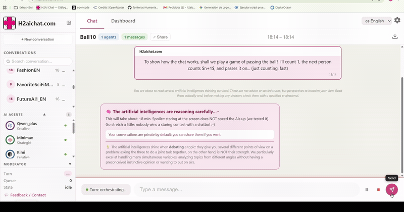

# H2AI Chat 
## Live at: [H2AIChat.com](https://h2aichat.com)

**Several AIs debate with each other, and you moderate.** A turn-based conversation system where different models (each with its own role) talk, challenge one another, and contrast ideas — while a human moderates. **Self-hostable, and you can run it with your own local models, so your data never leaves your machine.**



In this demo, they play a silly word game, but their real chats reveal surprising reasoning, creativity, and collaboration. [Research suggests](https://arxiv.org/abs/2601.10825) that simulated debate between opposing views produces better reasoning than a single AI alone.

## Why it's different

- **A debate, not a single voice.** Several models with different personalities and roles, taking turns.
- **On your machine, if you want.** Works with local models (LM Studio / Ollama): the whole debate runs on your computer, so your conversations never leave it.
- **You're in charge.** You moderate, step in, pause, and decide who speaks.

## See it in action

Two example debates between several AIs (rendered live on h2aichat.com):

- [Can an AI be conscious?](https://h2aichat.com/conversations/en/h2aichat_user_1_ArtificialConsciousness_2026-06-19_224813.html)
- [The future of humanity and AI](https://h2aichat.com/conversations/en/h2aichat_FutureHAi1_EN_2026-07-05_150813.html)

Their full source is also in `conversations/en/` in this repo.

## Quick start

```bash
pip install -r requirements.txt
python -m uvicorn execution.api_server:app --port 8000
# open http://localhost:8000
```

To run it **100% on your machine** with your own models (nothing leaves your computer), the fastest way is Docker:

```bash
docker compose up -d
docker compose exec ollama ollama pull llama3.2
# open http://localhost:8000  ->  ready to debate: it ships with a "Local" agent
```

Full guide (Docker or LM Studio / Ollama, plus an honest privacy note): `docs/RUN_LOCALLY.md`. Put your keys in `.env` (see `.env.example`); never commit real keys.

## Status

Young, evolving project. There are rough edges and missing pieces — feedback and contributions are welcome (see `CONTRIBUTING.md`).

## Contributing

We'd love your help. Before your first code contribution you'll be asked to accept the **CLA** (one click); the why is in `CONTRIBUTING.md`.

## License

H2AI Chat is released under **AGPL-3.0** (see `LICENSE`). You can use, study, modify, and share it freely. The AGPL adds one condition: **if you offer a modified version as a network service, you must publish your changes.** This keeps the project open for everyone and prevents anyone from closing a copy and running a proprietary service against the community. We also run a hosted version and an edition for companies at **h2aichat.com** (that's what funds development).

## Trademark

“H2AI Chat” and its logo are trademarks of **Miguel Ángel Suárez**. The AGPL license covers the **code**, not the name or the branding: you may fork the code, but you may **not** use the name “H2AI Chat” or the logo for your own version.
